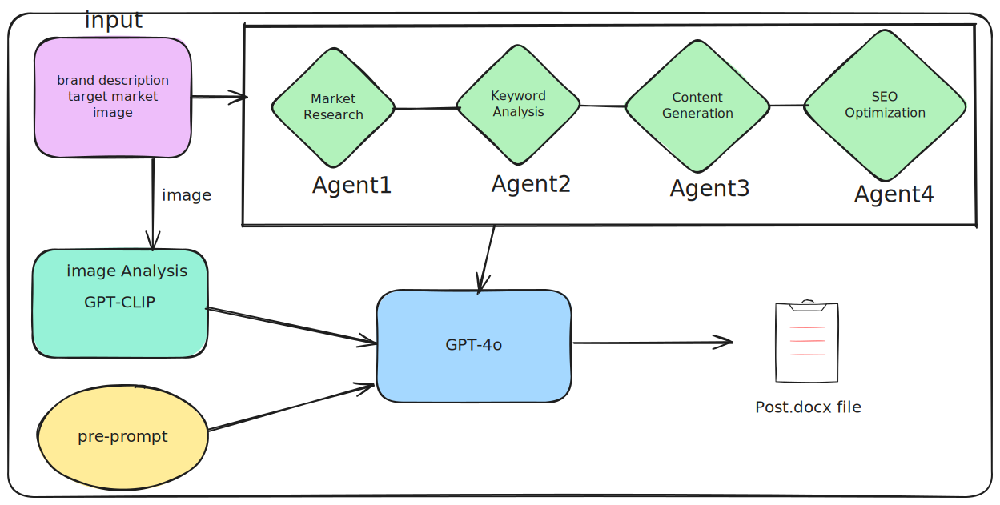

# Blog Marketing Automation Using GPT, LangChain, and CREW AI

## Overview



This project aims to develop an algorithm that automatically generates blog marketing posts by receiving brand descriptions and images. The posts will be saved as `.docx` files. The implementation leverages GPT, LangChain, and CREW AI to create an `Agent()` that automates this process.

## Usage

```bash
# Clone the project
git clone https://github.com/ddeji99/Auto_Post_Gen.git

# Navigate to the project directory
cd Auto_Post_Gen

# Run with image processing (incomplete)
python TRun.py

# Run without image processing
python Run_include_image.py
```
```bash
#example inputs
Enter brand description:
"Elegance is a fashion brand that harmonizes modern sensibilities with classic style, offering high-quality clothing and accessories. Our collection features stylish garments for all seasons, providing a wide range of options for trend-conscious customers. Elegance is committed to sustainable fashion, showcasing designs that allow customers to express their individuality."

Enter the target market (e.g., fashion industry, tech industry):
'fashion industry'

```


## Background

Blog marketing involves extensive market research, data collection, and SEO strategy development, which require significant time and human resources. By automating these repetitive tasks with AI, we can achieve cost reduction and increased efficiency.

### Efficiency Gains with AI Implementation:

- **Time Savings:** AI is particularly effective in automating data collection and analysis, reducing the time required for market data analysis and marketing strategy development.
  
- **Cost Reduction:** By automating labor-intensive and time-consuming processes, we can expect to save on costs.

### Importance of SEO and Strategy Development

SEO (Search Engine Optimization) is a crucial factor in the success of blog marketing. Achieving high rankings in search engines requires strategies such as keyword selection, meta tag configuration, and content optimization.

#### SEO Strategy Development Process:

1. **Keyword Analysis:** Analyze key market-related keywords and optimize the post’s title and content accordingly.

2. **Competitor Analysis:** Examine competitors’ blogs and content to identify their strengths and weaknesses, and develop a differentiated strategy based on these insights.

3. **Content Optimization:** Optimize AI-generated content to align with search engine algorithms, ensuring higher search rankings.

## Technical Implementation

This project uses GPT, LangChain, and CREW AI to develop a blog marketing automation system. The system automates market data collection and SEO strategy development with minimal pre-prompting.

### Input Configuration:
- **Brand Description:** A text description of the brand being marketed (e.g., product features, target market, etc.).
- **Images:** Key images related to the brand that will be used visually in the post.

### Output Configuration:
- **Blog Post:** The generated marketing blog post will be automatically saved as a `.hwp` file.

*Note: Final confirmation before uploading the post allows for improvements in the initial input prompt.*

### Implementation Process:
1. **GPT Model Utilization:** The GPT model drafts a blog post based on the provided brand description and images, generating natural and effective marketing content.

2. **CREWAI Integration:** CREWAI enhances the GPT-generated post by collecting additional information and applying SEO strategies, thereby improving the post's quality and search engine visibility.

3. **SEO Strategy Application:** Automatically performs SEO optimization on the generated text, including keyword density adjustment, metadata generation, and internal link optimization.

## Expected Agents

1. **Market Research Agent:** Conducts market research based on the provided information.
  
2. **Keyword Analysis Agent:** Analyzes and selects optimized SEO keywords based on market research findings.

3. **Content Generation Agent:** Creates an optimized blog post using the selected SEO keywords.

4. **SEO Optimization Agent:** Further optimizes the generated content.

## ※ Updates as of 8/29 ※
1. **langgraph** has been changed to **crew ai**.
2. The feature to add images when creating posts has been temporarily removed (code still exists).

## ※ Additional Development Possibilities ※
- The type of posts can be changed by modifying the prompt for Agent, Task, or GPT API.
- Additional research on the feature of adding images to posts using multimodality.
